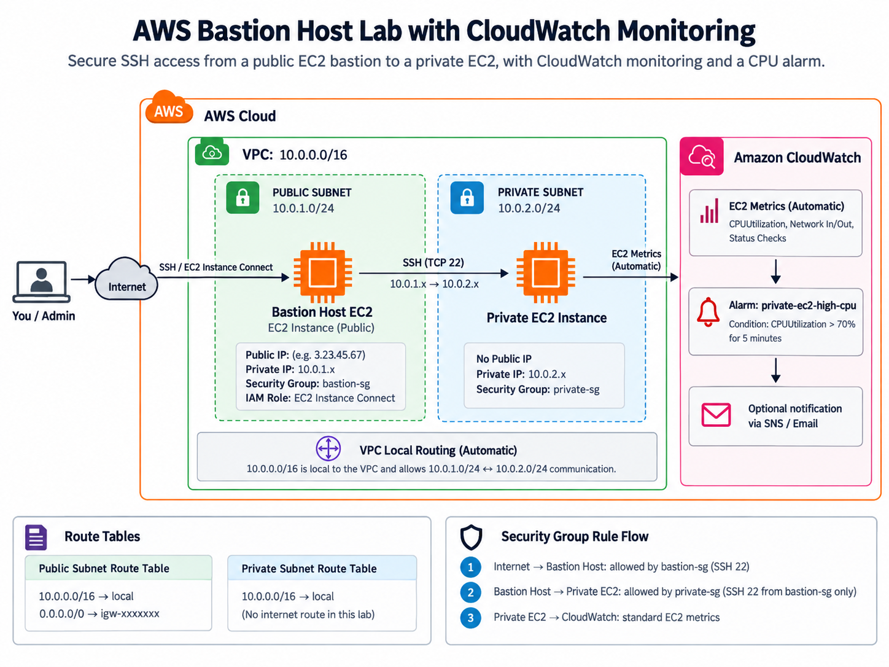

# AWS Bastion Host Lab with CloudWatch Monitoring

## Overview

This project demonstrates how to securely access an Amazon EC2 instance located inside a private subnet through a bastion host located in a public subnet.

The project also includes Amazon CloudWatch monitoring to observe EC2 performance and trigger an alarm when CPU utilisation on the private EC2 exceeds a defined threshold.

The purpose of the lab was to gain practical experience with:

- VPC networking
- Public and private subnets
- EC2 instances
- Bastion hosts
- Security Groups
- Route tables
- SSH key authentication
- IAM roles
- EC2 Instance Connect
- Amazon CloudWatch
- CloudWatch alarms

---

## Architecture



The access path is:

```text
Internet
   |
   v
Public EC2 / Bastion Host
Public Subnet
   |
   | SSH TCP/22
   v
Private EC2
Private Subnet
   |
   | EC2 Metrics
   v
Amazon CloudWatch
```

The private EC2 does not have a public IPv4 address.

Administrative access must therefore pass through the public EC2 acting as a bastion host.

---

# VPC Design

The environment contains one VPC with separate public and private subnets.

```text
VPC
<VPC_CIDR>
│
├── Public Subnet
│   └── Bastion EC2
│       ├── Public IPv4: <BASTION_PUBLIC_IP>
│       ├── Private IPv4: <BASTION_PRIVATE_IP>
│       ├── Instance ID: <BASTION_INSTANCE_ID>
│       └── Security Group: <BASTION_SECURITY_GROUP>
│
└── Private Subnet
    └── Private EC2
        ├── Private IPv4: <PRIVATE_EC2_PRIVATE_IP>
        ├── Instance ID: <PRIVATE_INSTANCE_ID>
        ├── No public IPv4
        └── Security Group: <PRIVATE_SECURITY_GROUP>
```

The instances are located in different subnets but remain within the same VPC.

Communication between the public and private subnets uses the VPC local route.

---

# Bastion Host

The public EC2 acts as the bastion host.

The bastion provides a controlled administrative path to the private EC2.

Instead of exposing the private instance directly:

```text
Internet
   X
   |
Private EC2
```

access follows:

```text
Internet
   |
   v
Bastion EC2
   |
   v
Private EC2
```

This allows the private EC2 to remain without a public IP address.

---

# Security Groups

Separate Security Groups are used for the bastion and private EC2.

## Bastion Security Group

The bastion EC2 is associated with:

```text
<BASTION_SECURITY_GROUP>
```

The bastion is permitted to initiate SSH traffic to the private EC2 Security Group.

Example:

```text
Type:        SSH
Protocol:    TCP
Port:        22
Destination: <PRIVATE_SECURITY_GROUP>
```

---

## Private Security Group

The private EC2 is associated with:

```text
<PRIVATE_SECURITY_GROUP>
```

Its SSH inbound rule allows traffic only from the Bastion Security Group:

```text
Type:     SSH
Protocol: TCP
Port:     22
Source:   <BASTION_SECURITY_GROUP>
```

This means the private EC2 does not expose SSH to:

```text
0.0.0.0/0
```

Instead, only the bastion host is permitted to attempt an SSH connection.

---

# SSH Authentication

Networking permission and SSH authentication are separate layers.

A successful connection requires:

```text
1. Routing
   Can the bastion reach the private subnet?

2. Security Groups
   Is TCP port 22 permitted?

3. SSH Authentication
   Can the bastion prove it is authorised?
```

During testing, this error was encountered:

```text
Permission denied (publickey,gssapi-keyex,gssapi-with-mic)
```

This confirmed that the private EC2 was reachable and that TCP port 22 was open between the two instances.

The remaining issue was SSH authentication.

---

# Bastion SSH Key

An SSH key pair was generated on the bastion:

```bash
ssh-keygen -t ed25519
```

This generated:

```text
~/.ssh/id_ed25519
~/.ssh/id_ed25519.pub
```

The files have different purposes:

```text
id_ed25519
= Private key
= Remains on the bastion

id_ed25519.pub
= Public key
= Can be provided to systems that trust the bastion
```

The private key is not transferred to the private EC2.

---

# IAM Role

An IAM role was attached to the bastion EC2.

The role is represented here as:

```text
<IAM_ROLE_NAME>
```

This allows the AWS CLI running on the instance to obtain temporary AWS credentials automatically.

This avoids storing:

```text
AWS_ACCESS_KEY_ID
AWS_SECRET_ACCESS_KEY
Personal AWS credentials
```

on the bastion.

The role can be tested using:

```bash
aws sts get-caller-identity
```

---

# EC2 Instance Connect

The bastion's public SSH key was temporarily provided to the private EC2 using EC2 Instance Connect.

```bash
aws ec2-instance-connect send-ssh-public-key \
  --region <REGION> \
  --availability-zone <AVAILABILITY_ZONE> \
  --instance-id <PRIVATE_INSTANCE_ID> \
  --instance-os-user ec2-user \
  --ssh-public-key file://$HOME/.ssh/id_ed25519.pub
```

A successful request returns:

```text
"Success": true
```

The SSH connection can then be made from the bastion using:

```bash
ssh -i ~/.ssh/id_ed25519 ec2-user@<PRIVATE_EC2_PRIVATE_IP>
```

This keeps the private EC2 inaccessible directly from the internet.

---

# Amazon CloudWatch Monitoring

Amazon CloudWatch was added to monitor the EC2 environment.

EC2 provides standard CloudWatch metrics automatically, including:

- CPU utilisation
- Network traffic
- Network packets
- Instance status checks

No CloudWatch Agent was required for this stage of the project.

The focus was kept on native EC2 metrics rather than OS-level custom metrics.

---

## CPU Alarm

A CloudWatch alarm was created for the private EC2.

The alarm monitors:

```text
Metric: CPUUtilization
Statistic: Average
Period: 5 minutes
Threshold: Greater than 70%
```

Example configuration:

```text
CPUUtilization > 70%
```

If the private EC2 CPU exceeds this threshold for the configured evaluation period, the CloudWatch alarm enters the `ALARM` state.

An SNS notification could optionally be added later to send an email notification.

---

# Why CloudWatch Was Added

Adding monitoring introduces an observability layer to the project.

The environment now demonstrates:

```text
Networking
   ↓
Security
   ↓
Authentication
   ↓
Monitoring
```

CloudWatch allows EC2 performance to be observed rather than relying only on manual SSH access.

---

# What I Learned

This lab provided practical experience with:

- AWS VPC architecture
- Public and private subnet design
- Internal VPC routing
- Bastion hosts
- EC2 Security Groups
- Security Group references
- SSH public/private key authentication
- IAM instance roles
- EC2 Instance Connect
- Troubleshooting SSH authentication
- CloudWatch EC2 monitoring
- CloudWatch alarms
- Understanding the difference between connectivity, authentication and monitoring

A useful mental model from the project is:

```text
Route Tables
= Where does traffic go?

Security Groups
= What traffic is permitted?

SSH Keys
= Who can log in?

IAM
= What AWS actions can an identity perform?

CloudWatch
= What is happening to the infrastructure?
```

---

# Security Considerations

The private EC2:

- Has no public IPv4 address
- Does not accept SSH from the internet
- Accepts SSH only from the Bastion Security Group

The bastion therefore acts as the administrative entry point into the private subnet.

For this learning environment, a traditional bastion architecture was used deliberately to understand AWS networking.

In larger production environments, additional controls may include:

- MFA
- Least-privilege IAM policies
- AWS Systems Manager Session Manager
- EC2 Instance Connect Endpoint
- VPC Flow Logs
- CloudTrail
- Centralised logging
- Restricted bastion access
- Automated patching

---

# Monitoring Considerations

This project currently uses standard EC2 CloudWatch metrics.

Future monitoring improvements could include:

- CloudWatch Agent
- Memory utilisation
- Disk utilisation
- System logs
- SSH authentication logs
- CloudWatch Logs
- SNS notifications
- Custom dashboards

These were intentionally left out of the initial lab to keep the focus on the core AWS networking and monitoring concepts.

---

# Future Improvements

Future versions of the project could include:

- Rebuilding the environment with Terraform
- Adding a NAT Gateway for private EC2 outbound internet access
- Adding VPC Flow Logs
- Creating CloudWatch dashboards
- Adding SNS email notifications
- Implementing more restrictive IAM policies
- Adding MFA-based administrative access
- Comparing bastion access with Systems Manager Session Manager
- Exploring EC2 Instance Connect Endpoint
- Automating infrastructure deployment through CI/CD

---

## Project Summary

This project demonstrates a complete introductory AWS infrastructure flow:

```text
VPC
   ↓
Public / Private Subnets
   ↓
Bastion Host
   ↓
Security Groups
   ↓
SSH Authentication
   ↓
IAM Role
   ↓
Private EC2 Access
   ↓
CloudWatch Monitoring
   ↓
CPU Alarm
```

The project was built as a practical exercise to understand how AWS networking, security and observability work together.